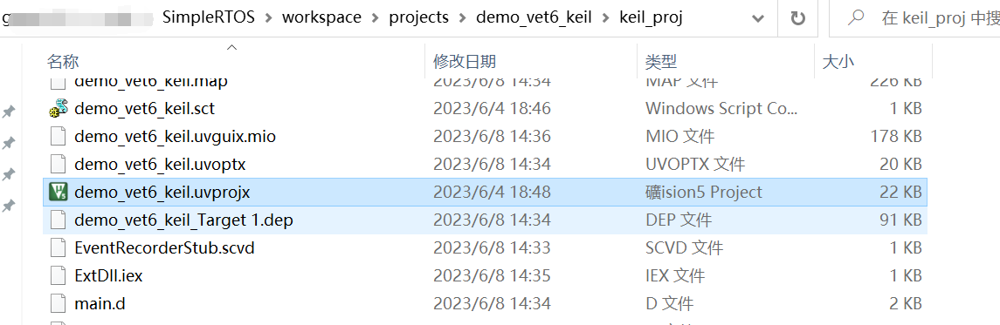
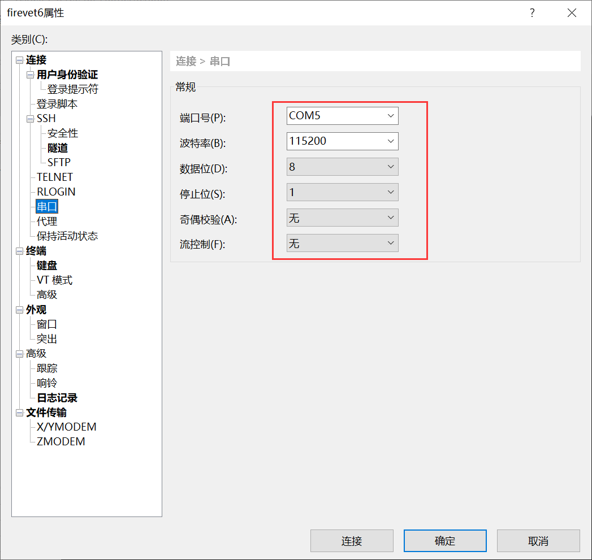
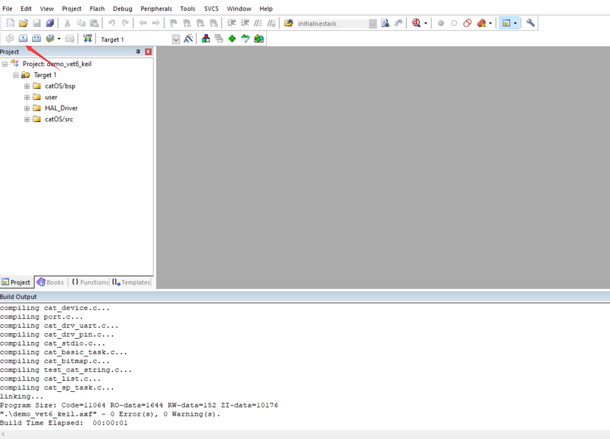
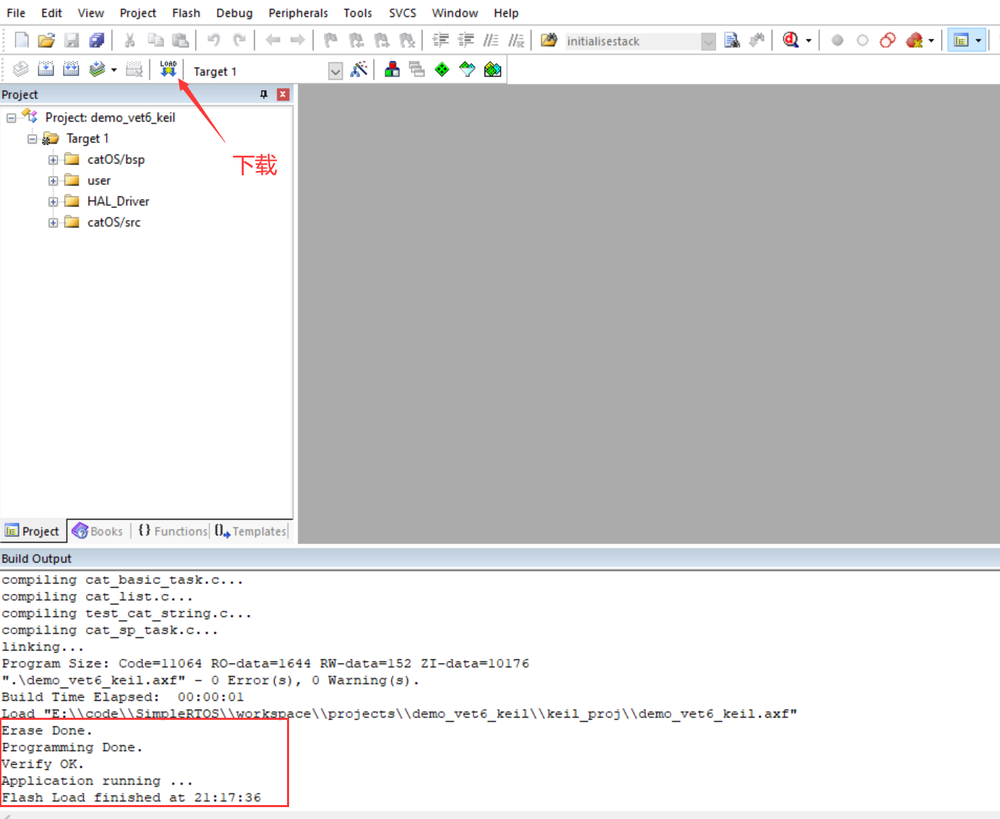
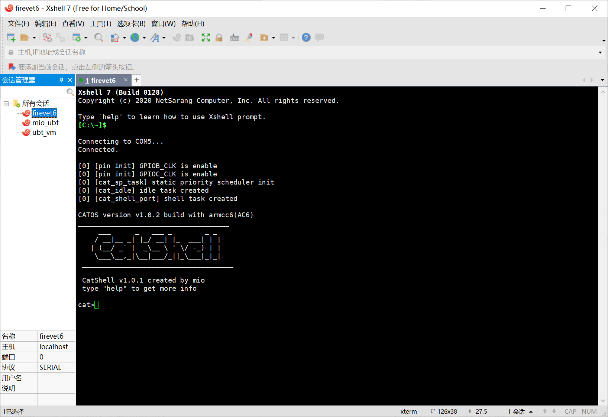

# SimpleRTOS(catOS)

[TOC]

## 一、简介

一个简单的嵌入式实时操作系统
- 抢占式优先级调度
- 可移植层
- 重写更简易更轻量级的部分库函数
- 除内核外还提供部分组件
  - 简易的`shell`程序
  - 设备驱动框架
  - 内存地址读写功能
- 通用性高的`makefile`编译框架

> 分支
>
> ver2: 第二个版本，重构大部分代码

## 二、构建与运行

### 2.1 硬件环境

---

| 开发板名称            | 芯片名称      | 芯片内核       | 调试器                | 其他硬件工具             |
| --------------------- | ------------- | -------------- | --------------------- | ------------------------ |
| 野火指南者开发板      | stm32f103vet6 | arm cortex-m3  | 野火 cmsis-dap 调试器 | ttl 转串口、usb 拓展坞等 |
| 野火瑞萨启明6M5开发板 | R7FA6M5BH3CFC | arm cortex-m33 | 野火 cmsis-dap 调试器 | ttl 转串口、usb 拓展坞等 |

> note：
>
> 1. 开发板和调试器可以自行选用，对于同一内核的开发板只需要微调项目代码即可，不同内核可以自行移植
> 2. 野火dap在ubuntu下好像有点问题，建议在windows下配合keil使用

### 2.2 软件环境

---

你可以选择一种你喜欢的系统环境进行开发

#### 2.2.1 windows环境

##### 	2.2.1.1 软件版本

  - 集成开发环境    `keil(MDK)`

- 交叉编译工具链 `arm compiler 6`

项目在 `keil MDK v5.38.0.0`下测试通过，`keil`版本详细信息：

  ```shell
  IDE-Version:
  μVision V5.38.0.0
  Copyright (C) 2022 ARM Ltd and ARM Germany GmbH. All rights reserved.
  
  Tool Version Numbers:
  Toolchain:        MDK-ARM Plus  Version: 5.38.0.0
  Toolchain Path:    D:\softwares\keil\keil_MDK_ARM\ARM\ARMCLANG\Bin
  C Compiler:         ArmClang.exe         V6.19
  Assembler:          Armasm.exe        	 V6.19
  Linker/Locator:     ArmLink.exe        	 V6.19
  Library Manager:    ArmAr.exe        	 V6.19
  Hex Converter:      FromElf.exe          V6.19
  CPU DLL:            SARMCM3.DLL          V5.38.0.0
  Dialog DLL:         TCM.DLL              V1.56.4.0
  Target DLL:         CMSIS_AGDI.dll       V1.33.15.0
  Dialog DLL:         TCM.DLL              V1.56.4.0
  ```

##### 2.2.1.2 开发环境设置

###### step1:  装好`keil`和相关软件包之后打开位于`SimpleRTOS/workspace/projects`下的`keil`工程

例如`stm32f103vet6`的项目：



###### step2: 连接好开发板调试器和串口，并确认供电正常

串口设置：



###### step3: 构建



###### step4: 下载



然后可以观察到串口输出，输入`help`可以查看当前`os`中的命令



#### 2.2.2 linux环境：

- 交叉编译调试工具 `gcc-arm-none-eabi`

- 项目构建        `makefile`

- pc端调试工具    `openocd`

##### 2.2.2.1 关键配置流程：

step1: 安装keil后打开项目，勾选project->manage->project items->Folders/Extensions->Use GCC Compiler for ARM projects

step2: 在step1的页面设置GCC路径为根目录(注意下载压缩包版本的工具链解压后外层会多一层目录，真正的工具链根目录包含了arm-none-eabi等多个目录)


交叉编译调试工具 `gcc-arm-none-eabi`

项目构建        `makefile`

pc端调试工具    `openocd`

`$sudo spt install openocd`

##### 2.2.2.2 构建运行

###### step1: 打开一个终端(终端1, 编译)

```shell
$git clone https://github.com/Simple-XX/SimpleRTOS.git
$cd SimpleRTOS/workspace
$make p=demo
```
编译完成后的生成文件位于workspace/output/demo目录下

如果你想：

- 调试->请看step2

- 只是运行->请看step4.1

--------------调试请从这里继续-------------------

###### step2: 另外打开一个终端(终端2, openocd连接调试器)

```shell
$openocd -f /usr/share/openocd/scripts/interface/cmsis-dap.cfg -f /usr/share/openocd/scripts/target/stm32f1x.cfg
#interface下有对不同调试器的支持
```
###### step3: 另外打开一个终端(终端3, 打开串口)

```shell
$minicom -D /dev/ttyACM0
#参数根据转串口驱动设备决定
#然后设置波特率
$[Ctrl-A]
$z
$o
->Serial port setup
A -    Serial Device      : /dev/ttyACM0
B - Lockfile Location     : /var/lock   
C -   Callin Program      :             
D -  Callout Program      :             
E -    Bps/Par/Bits       : 115200 8N1  
F - Hardware Flow Control : No          
G - Software Flow Control : No
```
修改完成后最好再次打开设置看是否保存设置成功

###### step4: 另外打开一个终端(终端4, 使用gdb与openocd配合下载并运行程序)

```shell
$../gcc-arm-none-eabi-10-2020-q4-major/bin/arm-none-eabi-gdb ./output/demo/bin/demo.elf
$sudo target remote localhost:3333
$load
$continue
```
--------------运行请从这里继续-------------------

###### step4.1:修改workspace/flash.sh中openocd为你的openocd安装目录

###### step4.2:使用openode下载程序到开发板并自动复位运行

```cmd
$./flash.sh
```

###### step5: 随即在终端3即可观察到串口输出

```
[cat_shell_port] cat_shell init success 
_____________________________________
     ___      _   ___ _        _ _   
    / __|__ _| |_/ __| |_  ___| | |  
   | (__/ _` |  _\__ \ ' \/ -_) | |
    \___\__,_|\__|___/_||_\___|_|_| 
 _____________________________________

 CatShell v1.0.1 created by mio 
 type "help" to get more info

cat>
```

## 目录结构

```shell
SIMPLERTOS
├─.vscode
├─Build
├─gcc-arm-none-eabi-10-2020-q4-major
├─notes
├─README.assets
└─workspace
    ├─catOS
    │  ├─bsp
    │  │  ├─arch
    │  │  │  ├─cortex_m3
    │  │  │  │  ├─board
    │  │  │  │  │  ├─stm32f103c8t6_min
    │  │  │  │  │  └─stm32f103vet6_fire
    │  │  │  │  └─libcpu
    │  │  │  └─cortex_m33
    │  │  │      ├─board
    │  │  │      │  └─ra6m5_fire
    │  │  │      └─libcpu
    │  │  ├─interface
    │  │  │  └─drivers
    │  │  └─Libraries
    │  │      ├─CMSIS
    │  │      └─STM32F1xx_HAL_Driver
    │  ├─include
    │  ├─src
    │  │  ├─component
    │  │  │  ├─cat_device
    │  │  │  ├─cat_shell
    │  │  │  ├─cat_stdio
    │  │  │  ├─cat_string
    │  │  │  └─mem_rw
    │  │  └─core
    │  │      ├─idle_task
    │  │      ├─init
    │  │      ├─interrupt
    │  │      ├─schedule
    │  │      │  ├─basic_task
    │  │      │  └─static_prio_sched
    │  │      └─support
    │  └─test
    ├─projects
    │  ├─common_configs
    │  ├─demo
    │  ├─demo_ra6m5_keil
    │  ├─demo_vet6_keil
    │  ├─demo_vet6_keil_gnu
    │  └─project_templete
    ├─third_party
    │  └─cm_backtrace
    └─tools
```

## 版权信息

此项目使用 MIT 许可证