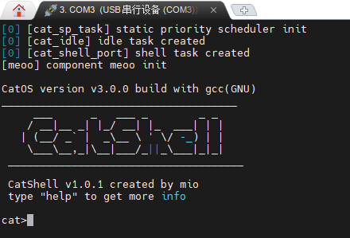

# SimpleRTOS(CatOS)

一个简单的嵌入式实时操作系统

<!-- PROJECT SHIELDS -->

[![Contributors][contributors-shield]][contributors-url]
[![Forks][forks-shield]][forks-url]
[![Stargazers][stars-shield]][stars-url]
[![Issues][issues-shield]][issues-url]
[![MIT License][license-shield]][license-url]

<!-- PROJECT LOGO -->
<br />

<p align="center">
  <a href="https://github.com/Simple-XX/SimpleRTOS/">
    
  </a>

  <p align="center">
    一个简单的嵌入式操作系统,超小!
    <br />
    <a href="https://github.com/Simple-XX/SimpleRTOS/tree/main/doc/"><strong>探索本项目的文档 »</strong></a>
    <br />
    <br />
    <a href="https://github.com/Simple-XX/SimpleRTOS/tree/main/projects">查看Demo</a>
    ·
    <a href="https://github.com/Simple-XX/SimpleRTOS/issues">报告Bug</a>
    ·
    <a href="https://github.com/Simple-XX/SimpleRTOS/issues">提出新特性</a>
  </p>

</p>

## 目录

- [CatOS](#catos)
  - [目录](#目录)
    - [文件目录说明](#文件目录说明)
    - [上手指南](#上手指南)
      - [开发前的配置要求](#开发前的配置要求)
      - [开发环境搭建](#开发环境搭建)
      - [**开发步骤**](#开发步骤)
        - [1. 创建项目](#1-创建项目)
        - [2. 添加代码](#2-添加代码)
          - [2.1 使用 cubemx 添加代码 (stm32推荐)](#21-使用-cubemx-添加代码-stm32推荐)
          - [2.2 自行添加代码](#22-自行添加代码)
        - [3. 编译调试](#3-编译调试)
        - [附 使用 MobaXterm 调试串口](#附-使用-mobaxterm-调试串口)
    - [开发的架构](#开发的架构)
    - [部署](#部署)
    - [使用到的框架](#使用到的框架)
    - [贡献者](#贡献者)
      - [如何参与开源项目](#如何参与开源项目)
    - [版本控制](#版本控制)
    - [作者](#作者)
    - [版权说明](#版权说明)
    - [鸣谢](#鸣谢)

### 文件目录说明

```
catOS
├─.vscode              vscode 项目配置文件
├─catos                catos 项目目录
│  ├─component         组件
│  │  └─cat_shell      shell命令行
│  ├─include           头文件目录
│  ├─src               源文件目录
│  └─test              测试相关
├─cmake                cmake规则
│  ├─target_arch       架构相关编译配置
│  │  ├─cortex_m3    
│  │  └─win64          (x)暂时没弄好
│  └─toolchain         编译链相关
├─doc                  文档
├─port                 移植包
│  ├─port_cortex_m3       
│  └─port_template     移植模板
├─projects             项目目录
│  ├─blink_with_cube   利用cubemx生成代码完成led闪烁的项目
│  ├─blink_with_reg    利用寄存器配置完成led闪烁的项目
│  └─project_template  项目模板
├─README.assets        readme图片
└─scripts              编译调试用的脚本
```

### 上手指南

#### 开发前的配置要求

1. windows10及以上操作系统（linux还未测试cmake构建)

#### 开发环境搭建

| 软件                             | 优点                                   | 缺点                                                         |
| -------------------------------- | -------------------------------------- | ------------------------------------------------------------ |
| cmake + makefile + gcc + openocd | 配置好后可以结合vscode有较好的调试体验 | 安装和配置较为麻烦，但本文档有一点点教程                     |
| keilMDK                          | 老牌IDE，编译很快，调试功能全面        | 有点老，UI和体验较差，但也可以使用vscode编辑，keil仅作为编译调试工具 |

note：貌似[xPack Binary Development Tools](https://github.com/xpack-dev-tools)这里有 cmake，arm-none-eabi-gcc 和 openocd，感兴趣可以试试，本项目目前只用过他的 openocd。

1. ##### 安装cmake

跨平台的构建工具，解决了仅使用 makefile 时构建脚本不同系统或平台不能通用的问题。

下载地址[Download CMake](https://cmake.org/download/)，选择合适的版本，win10选择最新的 Windows x64 Installer 即可。安装时可以顺便勾选添加到环境变量 (不知道选哪个就选 for all users)。

2. ##### 安装makefile

传奇构建工具，每个 c 开发者都应该了解和使用过他。

下载地址[Make for Windows](https://gnuwin32.sourceforge.net/packages/make.htm) (linux发行版一般都自带了makefile)，选择 Complete package 下载并安装，完成安装后将安装路径下的bin目录添加到环境变量。


3. ##### 安装arm-none-eabi-gcc

ARM公司使用 gcc 定制的开源工具套件，用于32位 arm 处理器嵌入式软件开发。

下载地址[Downloads | GNU Arm Embedded Toolchain Downloads – Arm Developer](https://developer.arm.com/downloads/-/gnu-rm)，如果没有习惯使用的版本可以和作者一样用 10-2020-q4-major 版本，下载解压后加入环境变量即可使用（也可使用安装包）。


4. ##### 安装openocd

一个超牛超方便的开源片上调试软件，可以结合 gdb 等工具进行嵌入式软件下载和调试。

下载地址[Releases · xpack-dev-tools/openocd-xpack](https://github.com/xpack-dev-tools/openocd-xpack/releases)下载 darwin-x64 就行，这里用的 0.12.0-3，日常下载解压后加入环境变量。

5. ##### 安装stm32cubemx

ST公司为他们的 stm32 系列 mcu 推出的图形化配置工具，可以方便地对芯片进行初始化配置，并生成相应的代码，用户只需要考虑应用逻辑而无需过多纠结于初始化。

下载地址[STM32CubeMX - STM32Cube initialization code generator - STMicroelectronics](https://www.st.com/en/development-tools/stm32cubemx.html#st-get-software)，选择windows版本下载安装即可。


6. ##### 安装MobaXterm

一个很好用的远程终端工具，包含 ssh、vnc 等功能，这里主要使用的是串口终端，也可以使用 putty 等终端工具。

下载地址[MobaXterm Xserver with SSH, telnet, RDP, VNC and X11 - Download](https://mobaxterm.mobatek.net/download.html)，下载免费版即可。

#### **开发步骤**

##### 1. 创建项目<a id="1_create_project"></a>

1.1 克隆catOS代码仓库
**注意**：由于在windows下执行bat脚本需要换行符格式为windows下的CRLF，而代码默认为unix和linux下的LF，因此克隆前最好设置git的换行符自动切换
```
git config --global core.autocrlf true
```
否则可能会出现以下状况


```sh
git clone https://github.com/Simple-XX/SimpleRTOS.git
```

1.2 在catOS/projects目录下复制project_template并重命名作为项目目录(以blink为例)

##### 2. 添加代码<a id="2_add_code"></a>

可以选择一种方式添加代码，如果使用的是stm32系列芯片可以选择 2.1 中的方式添加，比较方便，如果是其他芯片或想要挑战自己也可以选择 2.2 的方式，这种方式比较自由，但需要自己全权负责。

项目目录下已经有以下两种添加代码的方式的实例，分别为 blink_with_cube 和 blink_with_reg，可以直接跳到 [3. 编译调试](#3_compile_and_debug)，并对这两个项目编译运行。

###### 2.1 使用 cubemx 添加代码 (stm32推荐)<a id="2_1_add_with_cube"></a>

2.1.1 将 catOS/include/catos_config_template.h 复制到 blink/include 下并改名为catos_config.h，该文件为操作系统配置文件，可以对系统参数和功能进行配置。

2.1.2 添加移植包 port_cortex_m3 到 blink/src，并在 user.cmake 中设置 PORT_PACKAGE 变量。已经支持的移植包在 port 目录下，也可以自行移植，接口在 catOS/include/port.h 中声明。

2.1.3 使用 cubemx 生成代码

自行选用 cubemx 的版本，作者使用的是 6.14.0

2.1.3.1 选择芯片

在主页面选择`ACCESS TO MCU SELECTOR`选择自己的芯片，这里用 stm32f103c8t6 最小系统板作为硬件平台。


2.1.3.2 配置引脚和外设

- 1) 配置 RCC 使用高速外部晶振

最小系统板上一般有一块高速晶振 (8MHz)


- 2)配置 NVIC 异常处理代码生成

在可移植包中的 arch_xx_hw_s_gnu.s 中有 pendsv 和 hardfault 异常的处理，因此取消生成这两个异常处理函数


- 3)开启调试功能

Debug 模式选择 Serial Wire (sw) 如果不开之后可能无法正常下载


- 4)配置串口

stm32的串口有同步 (Synchronous) 和异步 (Asynchronous) 两种模式，这里就使用异步的串口模式，也是最常用的模式，并开启中断。


- 5)配置 led 引脚

可以查看自己开发板的原理图，这里led连接的是 PC13 引脚


2.1.3.3 配置时钟树

直接拉满 72MHz


2.1.3.4 配置代码生成

- 1）配置项目信息

  项目名称设置为 cubemx_project ，并选择项目目录下的 src 为生成目录，选择 IDE 为 MDK_ARM 即可。

  

- 2)代码生成选项中选择仅拷贝必要的库文件、生成独立的设备初始化文件

  

2.1.3.5 生成代码


2.1.4 在代码添加 catos 支持

2.1.4.1 添加 catos 头文件

在 cubemx_project/Core/Inc/main.h 中包含 catos.h:

```c
/* cubemx_project/Core/Inc/main.h */
...
/* Private includes ----------------------------------------------------------*/
/* USER CODE BEGIN Includes */
#include "catos.h"
/* USER CODE END Includes */
...
```

2.1.4.2 添加 OS 时钟中断处理

在时钟中断服务函数中调用 catos 的处理函数：

```c
/* cubemx_project/Core/Src/stm32f1xx_it.c */
...
/* Private includes ----------------------------------------------------------*/
/* USER CODE BEGIN Includes */
void cat_intr_systemtick_handler(void);
/* USER CODE END Includes */
...
void SysTick_Handler(void)
{
  /* USER CODE BEGIN SysTick_IRQn 0 */
  cat_intr_systemtick_handler(); /* catos 的时钟中断处理函数 */
  /* USER CODE END SysTick_IRQn 0 */
  HAL_IncTick();
  /* USER CODE BEGIN SysTick_IRQn 1 */

  /* USER CODE END SysTick_IRQn 1 */
}
...
```

2.1.4.3 注册串口设备

为了使用串口和 shell，还需要注册串口设备，可以在 usart.c 完成。

```c
/* cubemx_project/Core/Src/usart.c */
...
/* USER CODE BEGIN 0 */
static uint8_t _uart_char_buffer = 0; 
/* USER CODE END 0 */
...
/* USER CODE BEGIN 1 */
static cat_u8 uart1_init(cat_device_t *dev)
{
  (void)dev;

  /* 开始接受uart中断接收 */
  HAL_UART_Receive_IT(&huart1, &_uart_char_buffer, 1);

  return CAT_EOK;
}
static cat_u8 uart1_open(cat_device_t *dev, cat_u16 oflag)
{
  (void)dev;
  (void)oflag;
  return CAT_EOK;
}
static cat_u8 uart1_close(cat_device_t *dev)
{
  (void)dev;
  return CAT_EOK;
}
static cat_u32 uart1_read(cat_device_t *dev, cat_i32 pos, void *buffer, cat_u32 size)
{
  (void)dev;
  (void)pos;

  cat_u32 ret = HAL_UART_Receive(
      &huart1,
      (cat_u8 *)buffer,
      size,
      0x1000);

  return ret;
}
static cat_u32 uart1_write(cat_device_t *dev, cat_i32 pos, const void *buffer, cat_u32 size)
{
  (void)dev;
  (void)pos;
  cat_u32 ret = HAL_UART_Transmit(
      &huart1,
      (cat_u8 *)buffer,
      size,
      0x1000);
  return ret;
}
static cat_u8 uart1_ctrl(cat_device_t *dev, int cmd, void *args)
{
  (void)dev;
  (void)cmd;
  (void)args;
  return CAT_EOK;
}
static cat_device_t uart1_dev =
{
  .type = CAT_DEVICE_TYPE_CHAR,
  .init = uart1_init,
  .open = uart1_open,
  .close = uart1_close,
  .read = uart1_read,
  .write = uart1_write,
  .ctrl = uart1_ctrl,

  .pri_data = CAT_NULL
};
cat_u8 cat_debug_uart_register(void)
{
  cat_u8 err = cat_device_register(
    &uart1_dev,
    (cat_u8 *)"debug_uart",
    CAT_DEVICE_MODE_RDWR
  );

  CAT_ASSERT(CAT_EOK == err);

  return err;
}

/**
 * @brief 通知shell收到了一个字符(在接收中断中调用)
 * 
 */
void cat_shell_recv_char_notify(cat_u8 data);

void HAL_UART_RxCpltCallback(UART_HandleTypeDef *huart)
{
    if(USART1 == huart->Instance)
    {

        cat_shell_recv_char_notify(_uart_char_buffer);

        HAL_UART_Receive_IT(huart, &_uart_char_buffer, 1);
    }
}
/* USER CODE END 1 */
```

2.1.5 创建 blink 任务

在主函数中添加 blink 任务的结构体以及栈空间，并启动调度。

```c
/* cubems_project/Core/Src/main.c */
...
/* USER CODE BEGIN PV */
#define BLINK_TASK_STACK_SIZE    (2048)
static struct _cat_task_t blink_task;
static cat_u8 blink_task_stack[BLINK_TASK_STACK_SIZE];
/* USER CODE END PV */
...
/* Private user code ---------------------------------------------------------*/
/* USER CODE BEGIN 0 */
static void blink_task_entry(void *arg)
{
    (void)arg;
    for(;;)
    {
        HAL_GPIO_WritePin(GPIOC, GPIO_PIN_13, GPIO_PIN_SET);
        cat_task_delay_ms(1000);
        HAL_GPIO_WritePin(GPIOC, GPIO_PIN_13, GPIO_PIN_RESET);
        cat_task_delay_ms(1000);
    }
}
/* USER CODE END 0 */
...
/* USER CODE BEGIN 2 */
  catos_init();

  cat_task_create(
    (const uint8_t *)"blink_task",
    &blink_task,
    blink_task_entry,
    CAT_NULL,
    0,
    blink_task_stack,
    BLINK_TASK_STACK_SIZE
  );
  
  catos_start_schedule();
  /* USER CODE END 2 */
...
```


###### 2.2 自行添加代码<a id="2_2_add_with_diy"></a>

2.2.1 将 catOS/include/catos_config_template.h 复制到 blink/include 下并改名为catos_config.h，该文件为操作系统配置文件，可以对系统参数和功能进行配置。

2.2.2 如果使用 gcc 构建，需要添加链接脚本blink.ld (脚本名称要与项目名称匹配)。链接脚本可以通过使用的芯片厂商给出的 SDK 或实例代码中获得，感兴趣也可以自己研究编写。在链接脚本中需要在 data 段添加用于保存 shell 命令的区域：

```
.data : 
  {
    . = ALIGN(4);
    _sdata = .;        /* create a global symbol at data start */
    *(.data)           /* .data sections */
    *(.data*)          /* .data* sections */

/* CATOS 1: shell 命令结构体 */
    . = ALIGN(4);
    PROVIDE_HIDDEN (cat_shell_cmd_start = .);
    KEEP (*(cat_shell_cmd))
    PROVIDE_HIDDEN (cat_shell_cmd_end = .);

    . = ALIGN(4);
    _edata = .;        /* define a global symbol at data end */
  } >RAM AT> FLASH

  ...
```

2.2.3 添加移植包 port_cortex_m3 到 blink/src，并在 user.cmake 中设置 PORT_PACKAGE 变量。已经支持的移植包在 port 目录下，也可以自行移植，接口在 catOS/include/port.h 中声明。

2.2.4 添加代码

2.2.4.1 在 blink/include下添加头文件 main.h:

```c
#ifndef MAIN_H
#define MAIN_H

// 寄存器地址定义
#define PERIPH_BASE           ((uint32_t)0x40000000) /*!< Peripheral base address in the alias region */

#define AHBPERIPH_BASE        (PERIPH_BASE + 0x20000)
#define RCC_BASE              (AHBPERIPH_BASE + 0x1000)

#define APB2PERIPH_BASE       (PERIPH_BASE + 0x10000)
#define GPIOC_BASE            (APB2PERIPH_BASE + 0x1000)

#define RCC_APB2ENR_OFFSET    0x18
#define GPIOC_CRH_OFFSET      0x04
#define GPIOC_ODR_OFFSET      0x0C

#define RCC_CR                (*((volatile cat_u32*)(RCC_BASE + )))
#define RCC_CFGR              (*((volatile cat_u32*)(RCC_BASE + )))
#define RCC_CR                (*((volatile cat_u32*)(RCC_BASE + )))
#define RCC_CR                (*((volatile cat_u32*)(RCC_BASE + )))

#define RCC_APB2ENR           (*((volatile cat_u32*)(RCC_BASE + RCC_APB2ENR_OFFSET)))
#define GPIOC_CRH             (*((volatile cat_u32*)(GPIOC_BASE + GPIOC_CRH_OFFSET)))
#define GPIOC_ODR             (*((volatile cat_u32*)(GPIOC_BASE + GPIOC_ODR_OFFSET)))

#endif
```


2.2.4.2 在 src 中添加 main.c：

```c
#include "main.h"
#include "catos.h"

#define BLINK_TASK_STACK_SIZE    (2048)                /* blink任务栈大小 */
static cat_task_t blink_task;                          /* blink任务结构体 */
static cat_u8 blink_task_stack[BLINK_TASK_STACK_SIZE]; /* blink任务栈 */

/* blink任务函数 */
static void blink_task_entry(void *arg)
{
    (void)arg;
    /* 开启GPIOC时钟 */
    RCC_APB2ENR |= (1 << 4); /* 位4对应GPIOC时钟使能 */
    
    /* 配置PC13为输出模式（通用推挽输出，最大速度50MHz） */
    /* 清除CNF13[1:0]和MODE13[1:0]位，然后设置MODE13[1:0]=01（输出模式，最大速度10MHz） */
    GPIOC_CRH &= ~(0xF << 20); /* 清除位20-23 */
    GPIOC_CRH |= (1 << 20);    /* 设置MODE13[1]=1 */
    
    while(1)
    {
        GPIOC_ODR &= ~(1 << 13); /* 点亮LED（PC13低电平有效） */
        cat_delay_us(100000);
        GPIOC_ODR |= (1 << 13); /* 关闭LED */
        cat_delay_us(100000);
    }
}

int main(void) {
    
    catos_init();

    cat_task_create(
        (const uint8_t *)"blink_task",
        &blink_task,
        blink_task_entry,
        CAT_NULL,
        0,
        blink_task_stack,
        BLINK_TASK_STACK_SIZE
    );
  
    catos_start_schedule();

    while(1);
}

/* 串口设备实例(这个例子没用，可以自己写) */
static cat_device_t uart1_dev =
{
  .type  = CAT_DEVICE_TYPE_CHAR,
  .init  = CAT_NULL,
  .open  = CAT_NULL,
  .close = CAT_NULL,
  .read  = CAT_NULL,
  .write = CAT_NULL,
  .ctrl  = CAT_NULL,

  .pri_data = CAT_NULL
};

/* 注册串口设备 */
cat_u8 cat_debug_uart_register(void)
{
  cat_u8 err = cat_device_register(
    &uart1_dev,
    (cat_u8 *)"debug_uart",
    CAT_DEVICE_MODE_RDWR
  );

  CAT_ASSERT(CAT_EOK == err);

  return err;
}

/* 启动文件里调用了这个 */
void SystemInit(void)
{

}

/* 时钟中断服务函数 */
void SysTick_Handler(void)
{
    cat_intr_systemtick_handler();
}
```

##### 3. 编译调试<a id="3_compile_and_debug"></a>

3.1 cmake构建配置

project_template 下有两个 cmake 文件

```
CMakeLists-cubemx.txt 包含了将cubemx_project目录下的源文件添加到编译中的部分
CMakeLists-empty.txt  什么都不包含，要编译什么都可以自己加！
```

3.1.2 使用 cubemx 生成的代码

删除目录下的 CMakeLists-empty.txt，将 CMakeLists-cubemx.txt 改名为 CmakeLists.txt

3.1.3 自行添加的代码

删除目录下的 CMakeLists-cubemx.txt，将 CMakeLists-empty.txt 改名为 CmakeLists.txt并添加源文件和头文件，在 CmakeLists.txt 的 target_sources 中添加源文件:

```cmake
target_sources(user_project INTERFACE
    src/main.c
)
```

3.2 构建

在 scripts 目录下有多个批处理脚本，用于构建和调试：

| 脚本名        | 功能                      | 使用方法               |
| ------------- | ------------------------- | ---------------------- |
| build.bat     | 编译项目                  | build.bat [项目名]     |
| build_tests.bat| 编译项目(带测试部分)      | build_tests.bat [项目名]|
| clean.bat     | 在项目目录执行 make clean | clean.bat [项目名]     |
| clean_all.bat | 清理所有生成              | clean_all.bat          |
| flash.bat     | 烧写开发板                | flash.bat [项目名]     |
| gdb_start.bat | 启动gdb                   | gdb_start.bat [项目名] |
| ocd_start.bat | 启动openocd               | ocd_start.bat [项目名] |

**注意**：
1. 其中的 flash.bat 和 ocd_start.bat 要**根据自己的调试器进行配置**，使用openocd进行下载或调试的时候要指定两个配置文件 interface 和 target，分别描述使用的调试器和目标开发板，可选择的配置文件可以在 openocd 安装目录下的openocd/scripts/interface 和 openocd/scripts/target 中查看。

构建blink：
```bat
./scripts/build.bat blink
```
如果想运行系统功能测试，如互斥量对优先级反转的解决，消息队列等，要在 test/tests/tests_config.h 配置需要测试的功能，如果系统存储较小建议每次只开启一个，然后使用 build_tests.bat 进行构建：
```bat
./scripts/build_tests.bat blink
```

2.2.6 烧写和调试

启动串口终端程序并打开串口(MobaXterm可以看后一节[使用 MobaXterm 调试串口](#_use_mobaxterm))

编译的可执行文件位于 output/blink/blink.elf

烧写到开发板，同时会对开发板进行 reset 操作：
```bat
./scripts/flash.bat blink
```

此时串口终端应该出现输出:



输入`meoo`命令查看猫猫 (


如果需要调试，则先启动 openocd：

```bat
./scripts/ocd_start.bat
```

再用另一个控制台启动 gdb：
```bat
./scripts/gdb_start.bat
```

也可以使用 vscode 的调试支持使用 openocd，更方便，在 vscode 中下载 [Cortex-Debug](https://marketplace.visualstudio.com/items?itemName=marus25.cortex-debug) 插件并在 lunch.json中创建配置：
```json
"configurations": [
        {
            "cwd": "${workspaceRoot}",
            "executable": "${workspaceFolder}\\output\\blink\\blink.elf",
            "name": "debug blink",
            "request": "launch",
            "type": "cortex-debug",
            "servertype": "openocd",
            "interface": "swd",
            "device": "stm32f1x",
            "configFiles": [
                "interface/cmsis-dap.cfg",
                "target/stm32f1x.cfg"
            ],
            "searchDir": [],
            "runToEntryPoint": "main",
            "showDevDebugOutput": "none",
            "postLaunchCommands": [
                "monitor reset init"
            ]
        },
```

然后在 debug 视图下选择相应的调试配置即可


##### 附 使用 MobaXterm 调试串口<a id="_use_mobaxterm"></a>

启动 MobaXterm 后点击 Session->Serial，选择对应的串口号和比特率


### 开发的架构 

暂无

### 部署

暂无

### 使用到的框架

暂无

### 贡献者

暂无

#### 如何参与开源项目

贡献使开源社区成为一个学习、激励和创造的绝佳场所。你所作的任何贡献都是**非常感谢**的。


1. Fork the Project
2. Create your Feature Branch (`git checkout -b feature/AmazingFeature`)
3. Commit your Changes (`git commit -m 'Add some AmazingFeature'`)
4. Push to the Branch (`git push origin feature/AmazingFeature`)
5. Open a Pull Request


### 版本控制

该项目使用Git进行版本管理。您可以在repository参看当前可用版本。

### 作者

JiayuanWen (github: peach-1s-me)

qq:648137125  

 *您也可以在贡献者名单中参看所有参与该项目的开发者。*

### 版权说明

该项目签署了 Apache 授权许可，详情请参阅 [LICENSE](https://github.com/Simple-XX/SimpleRTOS/blob/main/LICENSE)

### 鸣谢


- [Img Shields](https://shields.io)
- [GitHub Pages](https://pages.github.com)
- [Cortex-Debug](https://github.com/Marus/cortex-debug)
- [Best-README-Template](https://github.com/othneildrew/Best-README-Template)
- [xpack-dev-tools/openocd-xpack: A binary distribution of OpenOCD](https://github.com/xpack-dev-tools/openocd-xpack)

<!-- links -->

[your-project-path]:Simple-XX/SimpleRTOS
[contributors-shield]: https://img.shields.io/github/contributors/Simple-XX/SimpleRTOS.svg?style=flat-square
[contributors-url]: https://github.com/Simple-XX/SimpleRTOS/graphs/contributors
[forks-shield]: https://img.shields.io/github/forks/Simple-XX/SimpleRTOS.svg?style=flat-square
[forks-url]: https://github.com/Simple-XX/SimpleRTOS/network/members
[stars-shield]: https://img.shields.io/github/stars/Simple-XX/SimpleRTOS.svg?style=flat-square
[stars-url]: https://github.com/Simple-XX/SimpleRTOS/stargazers
[issues-shield]: https://img.shields.io/github/issues/Simple-XX/SimpleRTOS.svg?style=flat-square
[issues-url]: https://img.shields.io/github/issues/Simple-XX/SimpleRTOS.svg
[license-shield]: https://img.shields.io/github/license/Simple-XX/SimpleRTOS.svg?style=flat-square
[license-url]: https://github.com/Simple-XX/SimpleRTOS/blob/main/LICENSE
