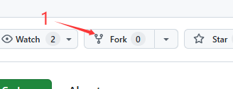
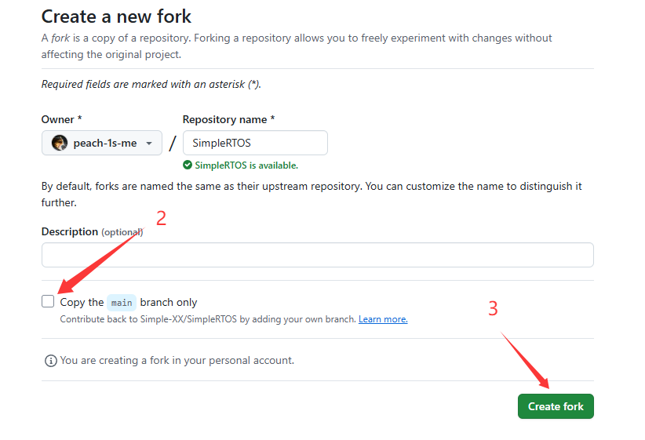

# SimpleRTOS github代码提交规范
## 1. fork仓库


注意取消勾选"仅复制主分支", 我们的代码主要基于develop分支进行修改和提交

## 2. 克隆到本地
### 2.1 克隆fork的仓库
```shell
git clone git@github.com:[你的githubID]/SimpleRTOS.git
```

### 2.2 进入仓库目录
```shell
cd SimpleRTOS
```

### 2.3 切换到 develop 分支

使用 GitBash 或其他可以使用 git 的终端打开克隆到本地的 fork-SimpleRTOS 目录

使用 `git branch -a`可以查看所有分支

切换到 develop 分支
```shell
git checkout develop
```

## 3. 修改代码
此时修改的代码在本地的develop下生效

## 4. 提交到本地
### 4.1 将代码修改加入暂存区
```shell
git add .
```
### 4.2 将代码提交到本地
```
git commit -m "[TAG] 1.修改内容1; 2.修改内容2;..."
```
其中 TAG 是提交标签, 表明提交的内容类型:
```
feat     新功能或特性
fix      修复bug
docs     文档更新
style    代码格式调整
refactor 重构代码
test     新增或更新测试
```
推送到远程 fork-SimpleRTOS 仓库
push前注意更新一下 fork-SimpleRTOS, 此时主 SimpleRTOS 仓库如果有更新, 可能和本地代码有冲突